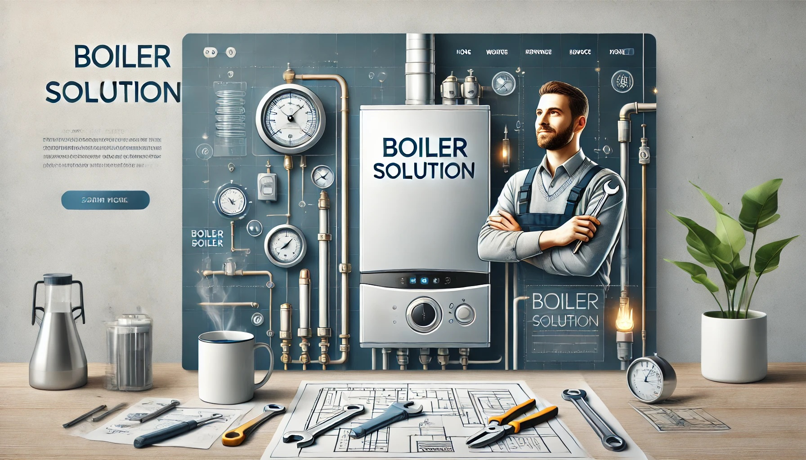

# Boiler Solution

We know how stressful it can be when your appliance stops working, not to mention the inconvenience of having no heating, hot water or cooking facilities.
We specialise in complex fault finding, diagnostics and repairs to get it back up and running again. We can professionally diagnose the issue and repair several types of appliances such as Cookers, Range cookers, Gas fires, Combi Boilers, System Boilers, Back boilers, and Regular Boilers.

## Installation

You'll need to install Node.js >=v14.16+ (Recommended Version) (NPM comes along with it) and Boiler Solution uses **Vite** for frontend tooling, to peform installation and building production version, please follow these steps from below:

- Use terminal and navigate to the project (boiler-solution) root.

- Then run : <code>npm install</code>

- Then run : <code>npm run dev</code>

Now, in the browser go to <code>https://localhost:3000</code>

**For Production Build**
Run : <code>npm run build</code>

Default build output directory: /dist

This command will generate a dist as build folder in the root of your template that you can upload to your server.
